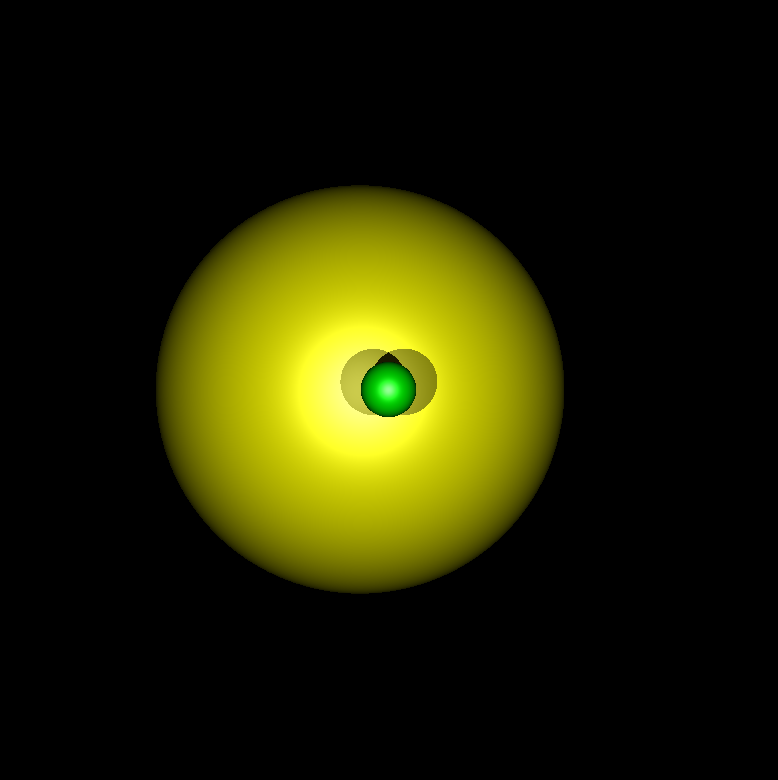
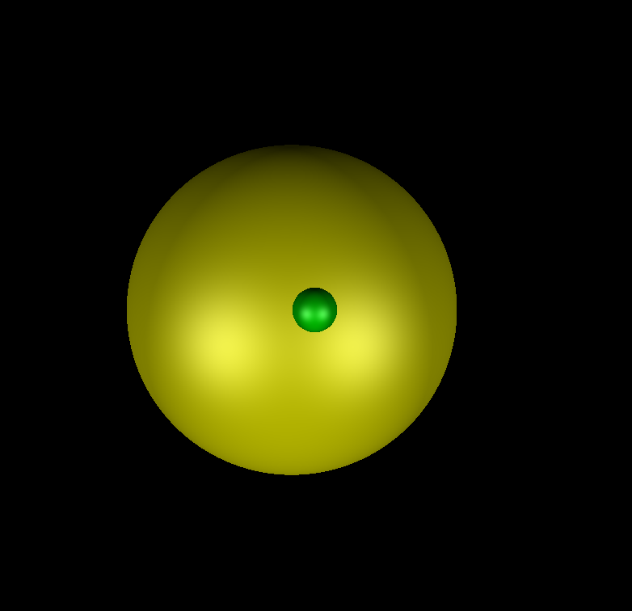
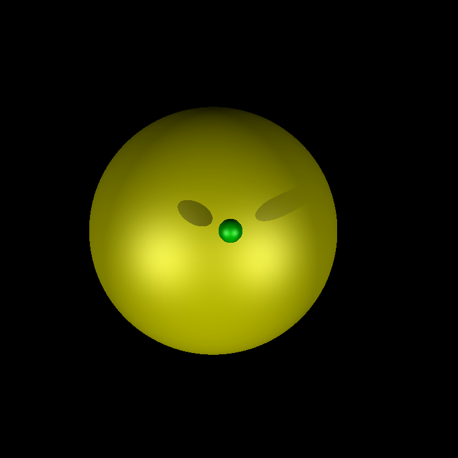
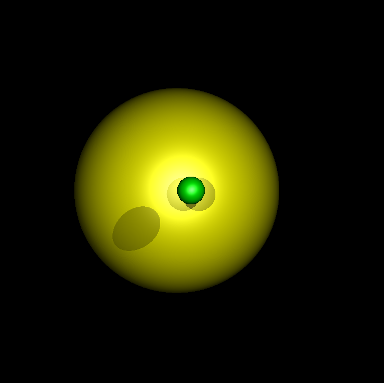
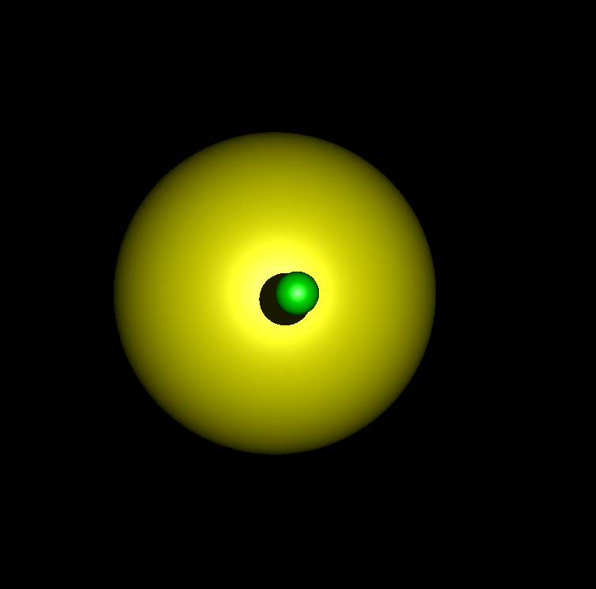
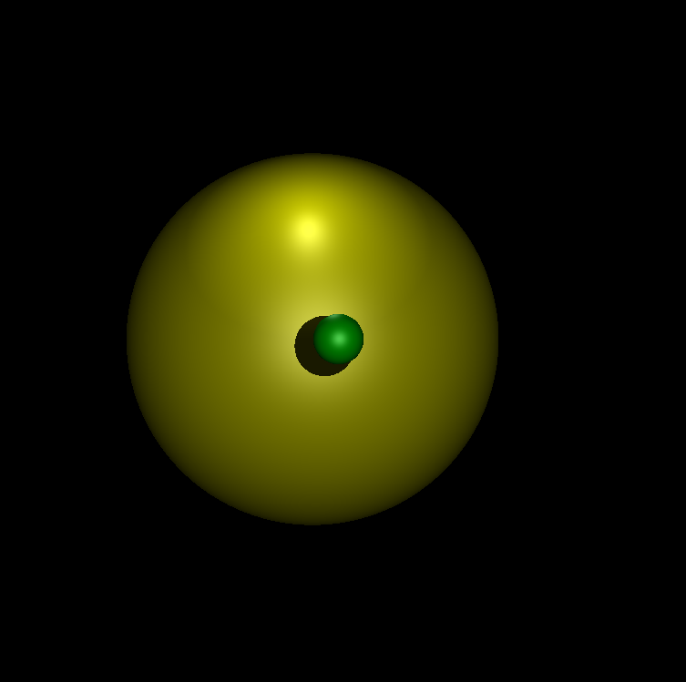
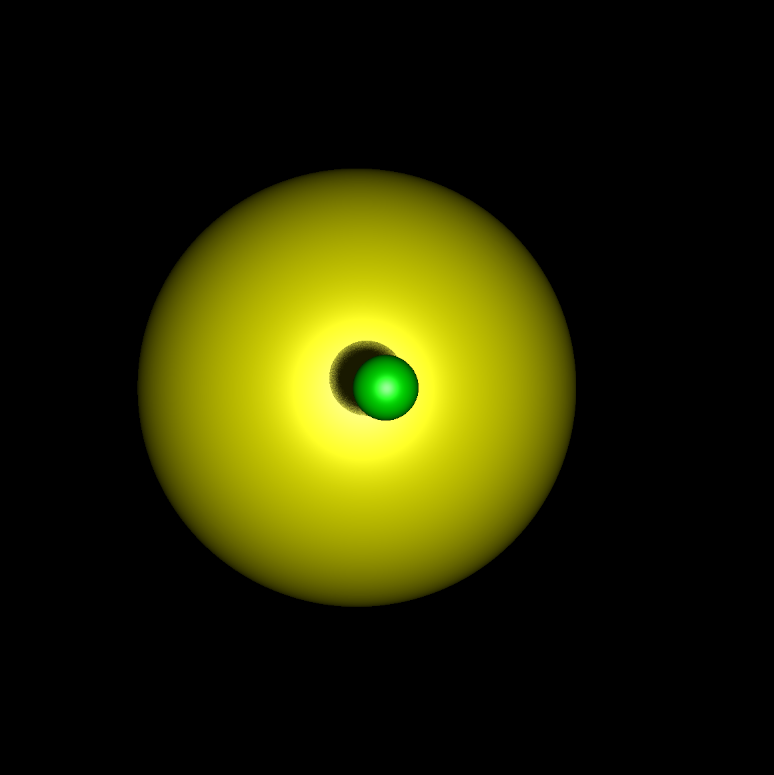
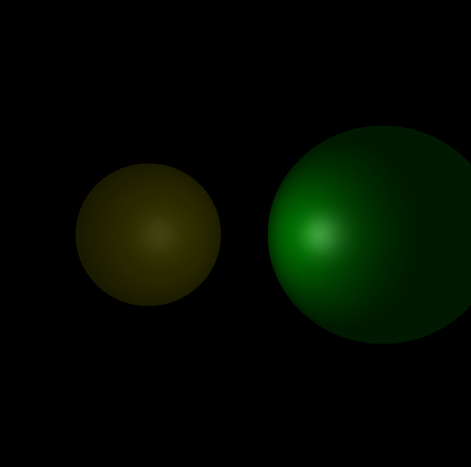

# CSCI 5607 RayTracer Readme File Hw1b
#### This is a readme file created by Junyue Tao about the ray-tracing program
## Build
The provided file includes a CMake file named CMakeList.txt.

Recommended CMake version on Windows is v3.13 or higher, as new features of CMake related to Visual Studio are released on that version. The version below 3.13 may lead to issues like being unable to set read-in file names using CMake stript.

---

### Build on Ubuntu
To build on Ubuntu, first, build using
```
cmake .
```
Then it will auto-generate Makefile on Ubuntu. Continue to execute the following command inside the terminal
```
make all
or
make
```
It will generate an executable file called raytracer. Use
```
./Raytracer <input_setting_file_name> <output_file_name> <alternative flag>
```
to execute the program.

### Obtain the output ppm file
The output ppm file will be at the same location as the program root file, named *"default_output.ppm"*.

---

### Build on Windows
To build on Windows, it is recommended to create an additional folder for auto-generated files and VS solution files, use the following command
```
mkdir build
cd build
cmake ..
```
It will auto-generate VS solution file on your Windows under the *\<build\>* folder we just created. Then open the VS solution file called *Raytracer.sln*, right-click Raytracer inside the Solution Explorer at the right side of the VS window, select "Set as startup project", then use the integrated debugger to debug or run the program.

### Passing parameters when using Visual Studio
The *CmakeList.txt* file contains one command line to automatically pass the alternative parameters for the program to enable specific functions such as light attenuation and soft shadows.

To use the Cmake file to pass parameters to Visual Studio, modify the *CmakeList.txt* file and find the following line:
```
set_target_properties(Raytracer PROPERTIES VS_DEBUGGER_COMMAND_ARGUMENTS "../setup.txt")

1. To enable light attenuation, add the keyword "-att" after "../setup.txt".
2. To enable soft shadow, add the keyword "-soft" after "../setup.txt".
3. To enable both features, add both of them, the order does not matter.
4. Remember to use space to separate them.
```
Alternatively, you can also manually modify the passing parameters inside Visual Studio by right click
### Obtain the output ppm file
The output ppm file will be at the same location where the VS solution file is located, named *"default_output.ppm"*.

---

The input file name is necessary to successfully execute the program, and the output file name is optional, if not provided, the default name will be used.

## File
The program is written in c++ and it depends on variety of files including "Vector3", "Point3", "Ray", etc. Files are built for later convenience of future improvement and further development.

**Additional changes have been made compared to the previous version 1a:**
1. Light attenuation
2. Soft Shadow

#### Ray.cpp
```
1. light attenuation
    The light attenuation is only applicable for a point light and it is implemented 
    by adding an attenuation variable called att_factor. The farther the object is 
    from the light source, the weaker the lighting effect of the light source. 
    
    To use light attenuation, make sure to pass the flag by adding "-att" at the end 
    of the command line.
    
    // implement light attenuation
    float att_factor = 1;
    if (ipp.GetFlagLightAtt() == 1) {
        if (light_.GetAttVar()[0] != -1) {
            float* att = light_.GetAttVar();
            Vector3 dis = light_.GetPointLtOrigin() - iPoint;
            float len = dis.Length();
            att_factor = 1.0f / (att[0] + att[1] * len + att[2] * len * len);
        }
    }
    
2. Soft Shadow
    The Soft Shadows feature allows us to create a "transition zone" between shaded 
    and light surfaces, rather than a simple light-dark boundary. 
    
    To use soft shadow, make sure to pass the flag by adding "-soft" at the end of the 
    command line. 
    
    // soft shadow
    float jitter_rad = 0.5;
    float soft_shadow_val = 0.0f;
    float soft_itr_size = 60.0f;
    // generate 30 different shadow ray to implement soft shadow
    for (int k = 0; k < soft_itr_size; k++) {
        shadow_flag = 1.0f;
        for (int j = 0; j < sphere_vec.size(); j++) {
            // prevent numerical error due to self_intersect
                if (j == obj_idx) {
                    continue;
                }
                Sphere shadow_sphere = sphere_vec.at(j);
                if (shadow_ray.IntersectSphere(shadow_sphere.GetOrigin(), shadow_sphere.GetRadius(), &shadow_t, &shadow_pt)) {
                    if (shadow_t > 0) {
                        if ((light_.GetW() == 1 && shadow_t < shadow_t_max) || light_.GetW() == 0) {
                            // there is some anpther sphere exist between the current sphere and current light source
                            shadow_flag = 0.0f;
                        }
                    }
                }
                soft_shadow_val += shadow_flag;
                }
                // generate random shadow ray here for next round
                Point3 new_lt_origin = light_.GetPointLtOrigin();
            for (int l = 0; l < 3; l++) {
                std::random_device randdev;
                std::mt19937 generator(randdev());
                std::uniform_real_distribution<> distrib(-jitter_rad, jitter_rad);
                float jit_delta = distrib(generator);
                new_lt_origin[l] += jit_delta;
            }
            Vector3 L_jit = new_lt_origin - iPoint;
            L_jit.Normalize();
            shadow_ray.set(new_lt_origin, L_jit);
        }
        shadow_flag = soft_shadow_val / soft_itr_size;
    }
```

## Functionality of parameters
### The effects of: ka, kd, ks, n, and Osl
The factors ka, kd, and ks are weights that control the surface’s ambient, diffuse and specular reflectivity respectively.
1. The higher the value of ka, the more "pure"(or bright) the color of the item will be.
2. The larger the value of kd, the more pronounced the "black marks" around the object will be. This trace makes an object that looks 2D look more like an object in 3D space.
3. The larger the value of Ks, the more obvious the effect of specular reflection on the surface of the object, and the brighter the white highlight spots will become.
4. The larger the value of n, the more concentrated the range of specular reflections will be. (The range of white highlighting will be reduced)
5. Osl controls the color of the reflected light from the specular surface. Perhaps our object is not always in a white light environment, and it is necessary to modify the value of Osl to simulate the corresponding light color.

### The use of a directional light source vs a point light source
I feel that the object under the point light source will produce a more realistic effect. Based on the different characteristics of the two light sources, I created two ppm images to show the effect of different types of light sources on the object and shadows. In the case of the same object position, the outline and shadows of the object are clearer and more realistic with the point light source. The light from directional light sources, because there is no angular variation (recall that with point light sources, all light originates from a single point), is inferior to point light sources in shaping objects and forming shadows.

In the second photo, the directional light source does not produce a shadow because the ball is not close enough to the large ball (although the position of the ball does not change in Figure 1 and Figure 2, the point light source produces a shadow). By bringing the sphere as close as possible to the ball, the shadows will eventually be obtained, but unlike the shadows of the point light source, the shadows of the directional light source are "stretched".(See picture 3)





### The use of multiple lights vs a single light
When there are multiple light sources in the scene, there will be a corresponding specular reflection bright spot on the surface of the object (if we do not use light source attenuation). The more light sources there are, the more vibrant and brighter the object will be, and the shadows created by each light source will become darker, as light from other light sources may illuminate this part of the shadow.

Notice that the color of the middle shadow is different when using multiple light sources.




If multiple light sources are in a different position, here we say point light, as an example: The sphere will have a variety of light effect based on where the light source is located. See the following pictures, one of the point light sources is located at the top of these two balls, and the other is at the same location around the camera.

Notice that there is only one shadow produced by the light source around the camera, this is because the light source is actually between these two spheres, hitting the backside of the green sphere, and that's why it does not have a shadow on the yellow sphere.



## Soft Shadow and Light Attenuation
### Soft Shadow


---

### Light Attenuation

